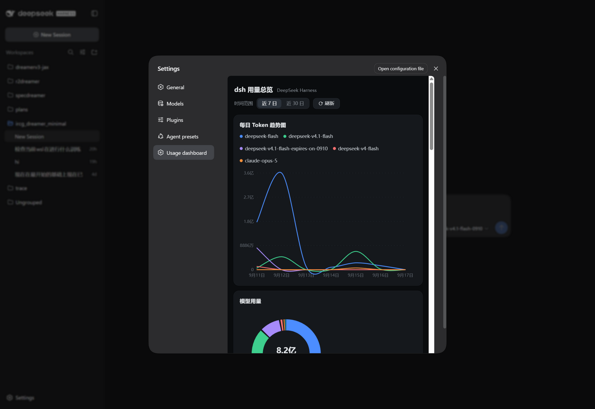
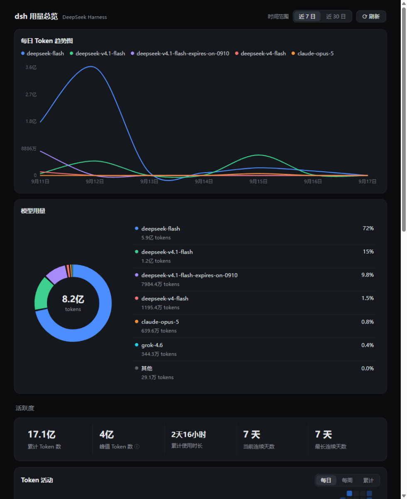

# dsh-usage-dashboard

A usage dashboard **plugin** for the [DeepSeek Harness](https://github.com/deepseek-ai) CLI (`dsh`). It parses the zstd session logs under `~/.dsh/sessions` and renders a GitHub-style usage overview **inside the dsh web UI** — no extra server, same origin.



Once installed, a **Usage dashboard** entry appears in **Settings → Plugins** (sidebar). Clicking it embeds the live dashboard:



## What you get

- **Daily token trend** — smooth per-model lines, 7-day / 30-day range toggle, hover tooltips
- **Model usage donut** — share per model over the selected range
- **Activity** — all-time totals, peak day, total active time, current/longest streaks, plus a 53-week **heatmap** (daily / weekly / cumulative coloring)
- **Usage trend** — cache-hit rate, token totals and daily average with previous-period deltas; stacked bars by **model or tool**, in tokens or an **estimated cost** (editable ¥/M-token price table stored in your browser)
- **System health** — per-model peak-time average **decode speed** (tokens/s), reconstructed from the stream timestamp deltas in the logs

The UI is currently Chinese (matching the author's locale); PRs for i18n are welcome.

## Requirements

- `dsh` 0.1.5-rc.1 or newer, with the **web** profile in use
- Node.js ≥ 22.15 / 24 (built-in zstd decompression) inside the environment where `dsh` runs
- `pnpm` on the `dsh` machine (the `dsh plugin` command forwards to it)

## Install

Inside the environment where `dsh` runs (WSL/Linux/macOS):

```bash
# once: install pnpm if needed
npm install -g pnpm

# from a git checkout of this repo
dsh plugin --profile web add file:/path/to/dsh-usage-dashboard

# or straight from GitHub
dsh plugin --profile web add github:gamelongtim-ux/dsh-usage-dashboard

# then (re)start the web UI — bundles load at boot
dsh web
```

Open the web UI → **Settings → Plugins**. The entry is listed under *Global plugins* and the dashboard lives in the sidebar. It is also reachable directly at **http://127.0.0.1:3080/usage-dashboard/**.

Update after pulling new code: re-run the same `dsh plugin ... add` command (file/git installs are copied, not linked), then restart `dsh web`.

Uninstall: `dsh plugin --profile web remove dsh-usage-dashboard`.

### Standalone mode (no dsh plugin machinery)

```bash
node server.js            # serves http://localhost:7900 (PORT env to override)
```

`server.js` uses the same parser and front-end with zero npm dependencies — handy for headless boxes or debugging.

## How it works

dsh is built on a cordis-style plugin system. A plugin is an npm package whose manifest declares:

```jsonc
{
  "dsh": {
    "bundle": { "patch": "./cordis.patch.yml" },  // host half
    "client": { "platform": "web", "inject": [] } // browser half
  }
}
```

- **Host half** (`lib/plugin.js`, mounted by `cordis.patch.yml`): `inject: ['webServer']` and registers a prefix route on dsh's own web server via `ctx.webServer.register({ kind: 'prefix', path, handler })`. It serves the dashboard assets and a `/api/data` JSON endpoint that parses the session logs on request (cached by file mtime/size, so running sessions show up on refresh).
- **Browser half** (`lib/client.js`, discovered via the `dsh.client` scan and served as `/plugins/??dsh-usage-dashboard/client.js`): registers a `settings.section` slot entry, which is what adds the sidebar entry and embeds the dashboard in an iframe. It is a dependency-free, hook-free component, so it composes safely with the shell's own React.

### Data extraction notes (reverse-engineered from dsh 0.1.5-rc.1 logs)

- Logs live at `~/.dsh/sessions/<workspace>/<session>/session(.v3)?.jsonl.zstd` — multi-frame zstd, split on the magic `28 B5 2F FD` and decompressed per frame.
- When a session directory contains **both** `session.jsonl.zstd` and `session.v3.jsonl.zstd`, the v3 file is a full rewrite: only v3 is parsed (avoids double counting).
- Usage lives in `assistant/chunk` (`chunk.type === 'usage'`) in old logs and in `assistant/message` → `data.usage` in v3 logs. `totalTokens = input + output + cacheRead`; `inputTokens` excludes cache reads; reasoning tokens are part of the output.
- Cache-hit rate = `cacheRead / (input + cacheRead)`.
- Decode speed: v3 logs carry per-message `stream` chunks with `time0 + dt[]` delta timestamps; older logs fall back to the (turn, step) chunk time span. Spans under 200 ms are ignored.
- Active time sums inter-event gaps capped at 5 minutes; streaks count days with `tokens > 0`.
- A few legacy files contain events with `time ≈ 0`; everything before 2020-01-01 is discarded (surfaced in the `dirty` field of `/api/data`).

## Repository layout

```
package.json          dsh.bundle + dsh.client declarations
cordis.patch.yml      inserts the usage-dashboard loader row (mount path configurable here)
lib/plugin.js         host half: webServer prefix route + static assets + API
lib/aggregate.js      log parsing & aggregation (shared by plugin and standalone modes)
lib/client.js         browser half: settings.sidebar section + iframe embed
public/               dashboard front-end (vanilla HTML/CSS/JS, hand-rolled SVG charts)
server.js, start.cmd  standalone mode on port 7900
```

## License

[MIT](LICENSE)
